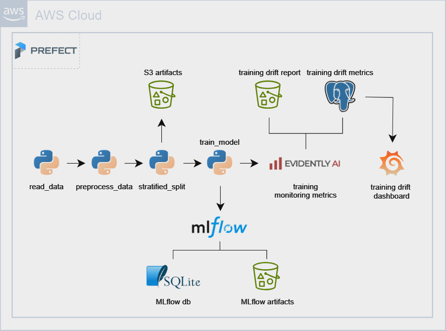
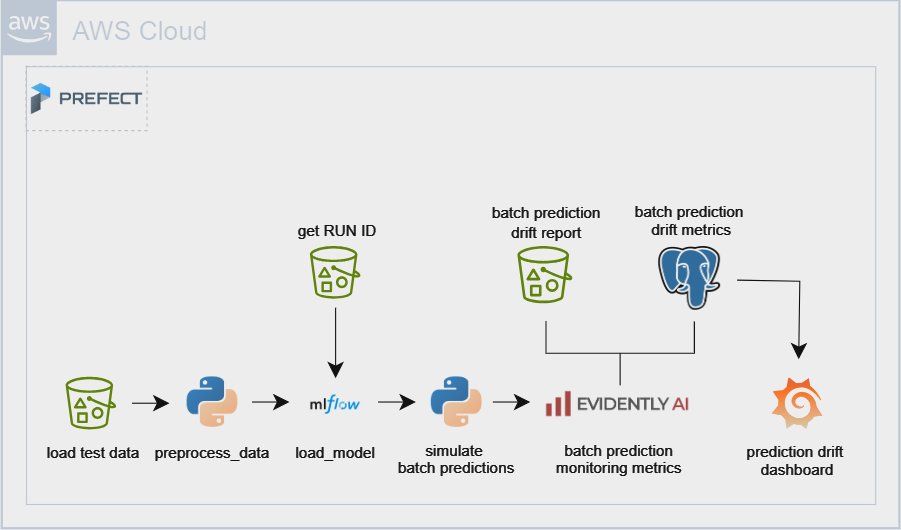
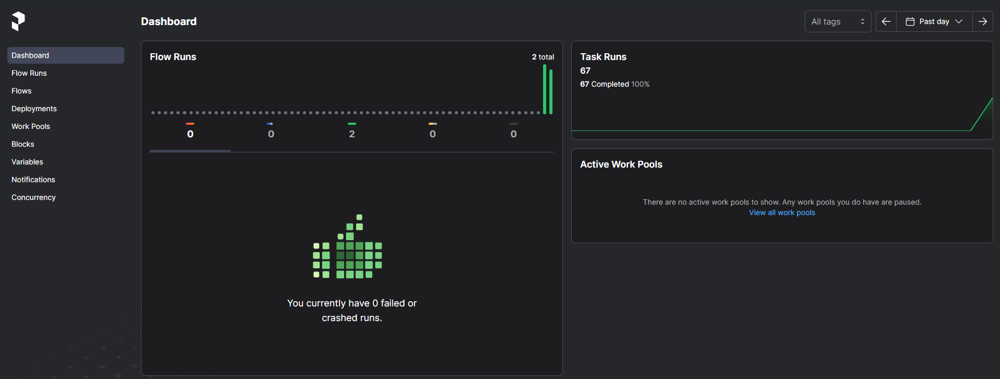
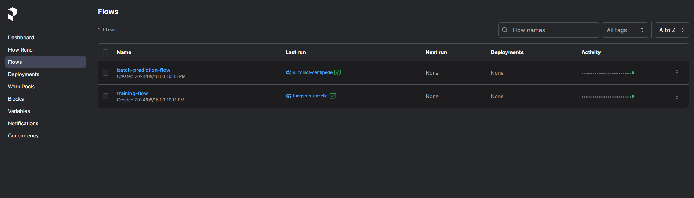
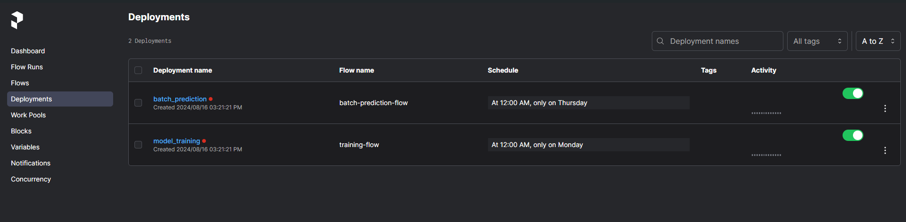
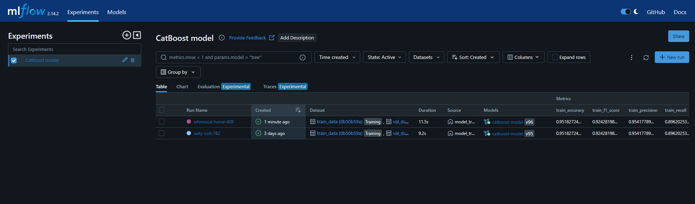
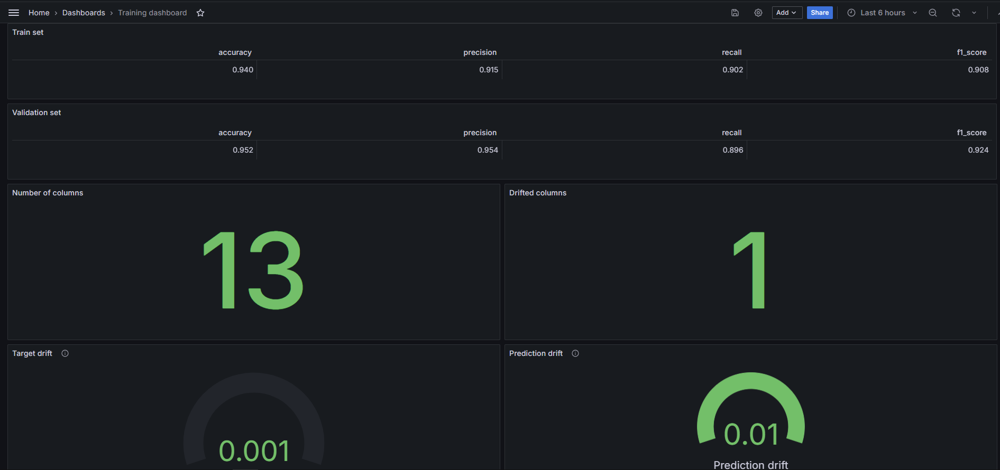
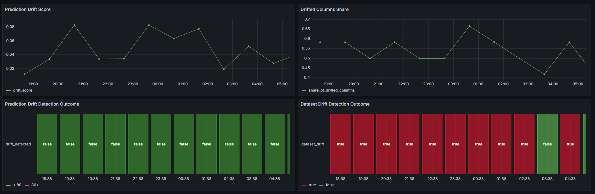

Image source: [pethavenm.org](https://pethavenmn.org/wp-content/uploads/2017/08/5a898cc6f6567557b5376222cfa764d593fd7cbb.jpg)

# Pet Adoption Classifier
This repository contains an implementation of an end to end pet adoption classifier.

It is the final project for the [MLOps Zoomcamp](https://github.com/DataTalksClub/mlops-zoomcamp) course from [DataTalks.Club](https://datatalks.club/).

## Author
- Name: Yorgos Papageorgiou
- [LinkedIn profile](https://www.linkedin.com/in/yorgos-papageorgiou-137312107/)

## About the project

The primary aim of this project is to develop an end-to-end machine learning system to predict the likelihood of a pet being adopted from a shelter.

> [!NOTE]
> The focus of this project is towards the implementation of MLOps practices rather than development of the ML model.

## About the data

Data source: [Predict Pet Adoption Status Dataset (Kaggle)](https://www.kaggle.com/datasets/rabieelkharoua/predict-pet-adoption-status-dataset/data)

The Pet Adoption Dataset provides a comprehensive look into various factors that can influence the likelihood of a pet being adopted from a shelter. This dataset includes detailed information about pets available for adoption, covering various characteristics and attributes. The data set consists of 2008 records. The complete csv file is located under the [data](data) directory of the repository.

## Project solution architecture

There are two main flows in this project. The training flow uses the training and validation data to train a CatBoost classifier that learns to predict the probability of a pet being adopted. The batch prediction flow retrieves the test data and uses the trained model to provide predictions. Both flows are described in detail below.

### Training flow


This section provides an overview of the training flow. The first step of the pipeline reads the csv file from the [data](data) directory of the repository. The preprocessing step casts all numerical columns as float type. Afterward, the data is split into three subsets (train, validation, and test) using stratified splitting, to ensure that the relative class frequencies are approximately preserved in each subset. All three subsets are stored in S3.

A CatBoost classifier with default hyperparameters is trained on the training set. The validation set is used to evaluate the performance of the model and select the optimal number of trees. Experiment tracking is implemented using MLflow with a SQLite database as the backend. All model hyperparameters, along with training and validation performance metrics, are logged in MLflow. Furthermore, the classification report and confusion matrix images from the validation set are tracked by MLflow. The MLflow Model Registry is used to promote the model to the production stage if the recall metric on the validation set exceeds the 0.9 threshold. The MLflow RUN ID of the promoted model is stored in S3. Model monitoring is implemented with Evidently AI.

The monitoring report is stored in S3, and a selection of monitoring metrics are stored in a PostgreSQL database. Finally, Grafana ingests the monitoring metrics to visualize the monitoring dashboard of the training flow.

### Batch prediction flow


The batch prediction pipeline begins with retrieving the test subset from S3 and applying the preprocessing to the data. The MLflow RUN ID of the production model is retrieved from S3, which is then used to load the trained model from MLflow.

The test subset is split into 12 chunks, and a timestamp incremented by 1 hour is appended to each chunk to simulate a batch prediction scenario. The model is applied to each chunk to predict the adoption probability. Evidently calculates a monitoring report for each chunk, which is stored in S3. A selection of monitoring metrics is stored in the PostgreSQL database. Finally, Grafana loads the batch prediction metrics from the PostgreSQL database to populate the batch prediction monitoring plots.

> [!NOTE]
> Due to the limited number of data records available (approx. 2000), the test set is preserved to simulate hourly batch predictions.

## Project set up

Before you build the project to start up the services required to execute the flows, there are some necessary steps that you need to perform. These pre-requisites are described in detail in the [PRE-REQUISITES](./PRE-REQUISITES.md) file.

## Build project

> [!IMPORTANT]
> Make sure to follow all the steps described in the [Project set up](#project-set-up) section, before you execute any of the commands below.

To start up the application stack run the following command:
```
make build
```
This command initiates all the necessary applications that are used in this project. You can find the complete list of all services as well as their url in the table below.

|   service   | port  | Interface  |          url           |       description       |
|------------ |------ |----------- |----------------------- |------------------------ |
| Prefect     | 4200  | 127.0.0.1  | http://127.0.0.1:4200  | Prefect UI              |
| MLflow      | 5000  | 127.0.0.1  | http://127.0.0.1:5000  | MLflow UI               |
| Grafana     | 3000  | 127.0.0.1  | http://127.0.0.1:3000  | Grafana UI              |
| Adminer     | 8080  | 127.0.0.1  | http://127.0.0.1:8080  | Adminer UI              |


> [!IMPORTANT]
> You might have to manually configure the port-forwarding from VScode in your machine in order to be able to access the URL links above.

To kill all services, press Ctrl+C and then type
```
make kill_services
```
This command will stop all services and delete all Docker volumes.

## Workflow orchestration with Prefect
Workflow orchestration and deployment is implemented using [Prefect](https://www.prefect.io/).

There are two main flows in this project, the `training_flow` and the `batch_prediction_flow`. The Python scripts for both flows can be accessed at [pet_adoption/flows/](pet_adoption/flows/) directory.

### Execute the Prefect flows

To run both flows, open a new terminal and run:

```
make run_flows
```

This make command will first execute the training flow and then the prediction flow. You can access the [Prefect UI](http://127.0.0.1:4200) to see the execution of both flows.

### Prefect UI dashboard


### Prefect UI flows



### Deploy the Prefect flows and manually run them from Prefect UI

To deploy the Prefect flows, run the following command:

```
make prefect_deploy
```

This command will deploy the workflows, create a Prefect worker and finally start the worker. Once this step finishes, you can access [Prefect UI](http://127.0.0.1:4200) and see the scheduled deployed flows.



## Experiment tracking with MLflow
This project uses [MLflow](https://mlflow.org/) to track experiments and register the trained model in the model registry.

MLflow Tracking Server is used to track the experiments and log training artifacts and metrics. Furthermore, the trained model is rgistered in the Mlflow Model Registry and is promoted to production stage, if the Recall on the validation set exceeds acertain threshold. Once the training pipeline executes, you can access the [MLflow UI](http://127.0.0.1:5000) to view the experiment run and all the relevant metrics and artifacts.



## Monitoring with Evidently

Both flows are monitored using [Evidently AI](https://www.evidentlyai.com/). The metrics are collected during the flow runs and are stored in a PostgreSQL database. Grafana connects to the database to get the metrics and build the monitoring dashboards. Access the [Evidently UI](http://127.0.0.1:3000) to view the dashboards. The user name and password are both 'admin'.

### Grafana Training Monitoring dashboard


### Grafana Prediction Monitoring dashboard


## Unit tests
Run the unit tests and generate the coverage report:
```
make tests
```

## Linting and formatting
This project uses [Ruff](https://docs.astral.sh/ruff/) for both linting and formatting. Details about the configuration can be found in the [pyproject.toml](pyproject.toml) file.

## Pre-commit hooks
Pre-commit hooks are used for code linting/formatting and other checks before every commit. You can find the complete configuration in the [.pre-commit-config.yaml](.pre-commit-config.yaml) file.

## Git

### Branching strategy
The primary stable branch is `main`. This branch is protected, meaning you can not directly push commits on this branch. You can checkout the `development` branch and commit your changes directly on that branch. Pushing the new commits to the remote will trigger the [CI pipeline](#ci-with-github-actions). If the CI pipeline is successfull, you can create a pull request from `development` to the `main` branch to merge your changes.

Alternatively, you can create a feature branch from `development`, commit your changes and push your branch to the remote. Then, create a pull request form your feature branch to `development`. This step will trigger the [CI pipeline](#ci-with-github-actions). If the CI pipeline is successfull, you can merge your changes to the `development` branch. Finally, you should create another pull request from the `development` branch to `main` to merge your changes to the main stable branch.

### CI with Github Actions
The CI pipeline is executed whenever new commits are pushed on the `development` branch or a pull request is created from a feature branch to `developemnt`. The CI pipeline performs code linting and formatting using Ruff and finally executes the unti tests and generates the code coverage report.


## Backlog for future improvements
1. Add integration tests by testing complete Prefect flows.
2. IaC with Terraform to manage the infratructure.
3. Use AWS EventBridge to trigger the prediction pipeline automatically when a new test set is uploaded in S3.
4. Add Continuous Deployment Github action to deploy docker-compose on ECS.
